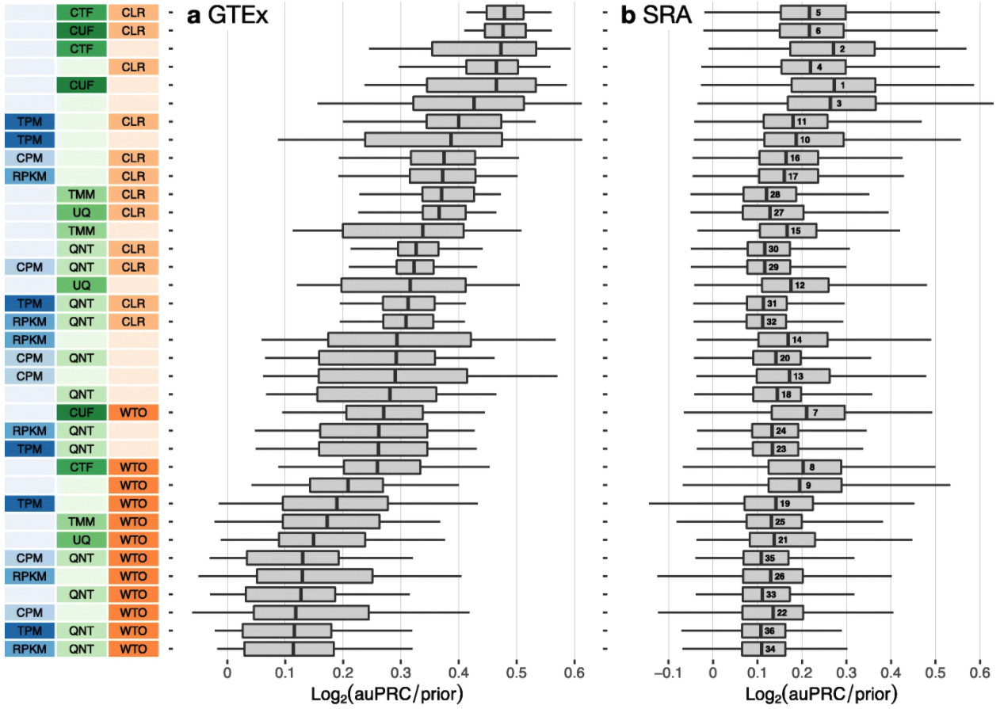

```{r include=FALSE}
library(knitr)
```

This post is a small celebration of my first first-author paper being published. If you are interested in coexpression networks, you can check out the research article [here](https://genomebiology.biomedcentral.com/articles/10.1186/s13059-021-02568-9/). The point of this post is not really about the research itself, but rather how I made the plot labels for each workflow I was benchmarking. An example of these labels can be seen on the left in Figure 2 of my paper, shown below.

```{r echo=FALSE,out.width='100%',fig.alt="Figure that shows a boxplot of the performance of multiple benchmarked workflows, where the labels I am referring to in this post are shown on the left. These labels are described further in the next paragraph of the post."}

```

This figure is a boxplot of the performance of multiple benchmarked workflows. For each workflow, three method choices are made, which correspond to the three colors/columns in the labels. The blue column represents the "within-sample normalization" method choice where each option (none, CPM, TPM, or RPKM) corresponds to a given shade of blue. The green and orange columns are similar, representing "between-sample normalization" and "network transformation" method choices, respectively. The very top method in the labels therefore corresponds to the workflow in which no within-sample normalization method was chosen ("none" is the lightest shade with nothing written in the box), "CTF" was chosen for between-sample normalization, and "CLR" was chosen for network transformation. The meaning of these categories is not really important to this post, we just need to know that three choices (each a separate category) are made to makeup one workflow, each category has its own color, and each choice within a category has its own shade.

First let's load our packages. I need `tidyverse` for making the plots, `patchwork` for putting the plots together, and I don't _need_ `ggfittext` per say, but it is much easier than manually finding the perfect text size for my labels.
```{r message=FALSE}
library(tidyverse)
library(patchwork)
library(ggfittext)
```

Here we set up the data table for the labels. I am using only a subset of workflows that I benchmarked for simplicity. This subset yields four choices for our blue category, four choices for the green category, and three choices for the orange category. In each category, "none" is an option. 
```{r}
method_codes <- tibble(workflow = c("counts", "QNT", "TMM", 
                                    "UQ", "CPM", "CPM_QNT", "RPKM", 
                                    "RPKM_QNT", "TPM", "TPM_QNT", 
                                    "CLR", "QNT_CLR", "TMM_CLR", 
                                    "UQ_CLR", "CPM_CLR", "CPM_QNT_CLR", 
                                    "RPKM_CLR", "RPKM_QNT_CLR", "TPM_CLR",
                                    "TPM_QNT_CLR", "WTO", "QNT_WTO", 
                                    "TMM_WTO", "UQ_WTO", "CPM_WTO", 
                                    "CPM_QNT_WTO", "RPKM_WTO", 
                                    "RPKM_QNT_WTO", "TPM_WTO", "TPM_QNT_WTO"))
```


